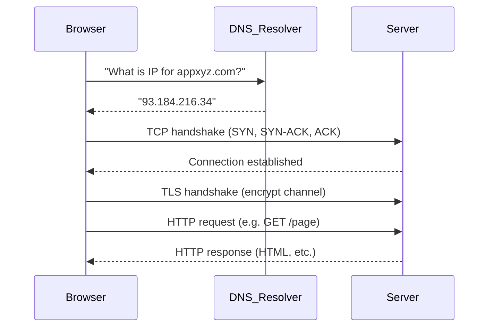

# System Design Notebook

> A personal notebook to learn system design concepts from the ground up.
> Add your own notes under each topic as you study it.
>
> **Last updated:** ___________

---

## How to Use This File

- Work through the parts **in order** — each part builds on the previous one.
- Check off `- [ ]` boxes as you complete a topic.
- Expand each topic heading with your own notes, diagrams, and examples.
- Grow the **Glossary** as you encounter new terms.
- Log useful books, courses, and links in the **Resources** section.

---

## Fundamental Architecture Template

> Almost every system design problem is a variation or extension of this pattern.
> Understand this first. Everything else adds onto it.

```
         Client
           ↓
     Load Balancer
           ↓
    Servers (stateless)
      ↓          ↘
   Cache      Message Queue
      ↓              ↓
   Database       Workers
```

Read flows: Client → Load Balancer → Server → Cache → Database (on cache miss)
Write flows: Server → Database + optionally enqueue background work via Message Queue

---

## Learning Roadmap

```
Part 1 → Part 2 → Part 2.5 → Part 3 → Part 4 → Part 4.5 → Part 5 → Part 6 → Part 6.5 → Part 7
```

Do not skip to Part 7 without being comfortable with Parts 1–6.

---

## Part 1 – Foundations

> Goal: Understand how the web and data systems work at a basic level.

- [ ] **How the internet works** — DNS, HTTP/HTTPS, TCP/IP, packets
- [ ] **Client-Server model** — requests, responses, stateless vs stateful
- [ ] **Request lifecycle walkthrough** — step-by-step trace of a single request: browser → DNS lookup → TCP connection → Load Balancer → App Server → Cache check → Database (on miss) → response travels back; understand what happens at each hop and where latency is introduced
- [ ] **APIs** — REST, GraphQL, gRPC; when to use which
- [ ] **Databases: SQL vs NoSQL** — high-level differences, use cases
- [ ] **Networking basics** — latency, bandwidth, throughput, RTT

### My Notes – Part 1

#### How the internet works

**DNS (Domain Name System)** — "Phone book" for the internet. A domain (e.g. `appxyz.com`) is mapped to one or more IP addresses. When someone types a domain, the **name is resolved to an IP** (we say "resolved," not "redirected" — redirect is when HTTP tells the browser to go to another URL). The DNS resolver (e.g. ISP or 8.8.8.8) may return multiple IPs; the **client** (browser/OS) selects one; for big providers like Google, DNS is often geographic or load-aware so you get an IP that's close or less loaded.

**Protocol** — A set of rules for actors trying to communicate. Application-layer protocols include: DNS (resolve names to IPs), DHCP (auto-assign IPs), FTP (file transfer), HTTP (web pages/resources), IMAP/POP3/SMTP (email), IRC (chat).

**TCP/IP** — Network model. **TCP** (Transport) breaks data into segments, delivers them reliably, and hands off to **IP** (Network). IP adds logical addressing and routing. Terminology: we say **congestion control** (not "congestion throttling") when TCP slows down on packet loss. TCP **establishes a connection** (not "the network") between client and server.

**TCP steps:** (1) **Three-way handshake** — connection establishment (SYN, SYN-ACK, ACK). (2) **Data transfer** — error-free, ordered, with retransmission of lost data, duplicate discard, congestion control. (3) **Four-way handshake** — connection termination.

**Layers (high level):** Application (HTTP, DNS, …) → Transport (TCP or UDP) → Network (IP: addressing, routing) → Data Link → Physical.

**Packets** — At the Network (IP) layer, data is sent in **packets** (each has source/dest IP, payload). Packets can take different paths and be reassembled at the destination. TCP segments are carried inside IP packets.

**UDP** — The other main transport option: no connection, no guarantee of delivery or order. Used where speed matters more than reliability (e.g. DNS queries, live video, gaming). TCP = reliable, ordered; UDP = best effort.

**HTTPS** — HTTP over **TLS**; TLS sits between HTTP and TCP and encrypts the data. So for HTTPS: Application (HTTP) → TLS (encryption) → TCP → IP → …

**Request sequence** (e.g. typing `https://appxyz.com/page`): DNS resolution (name → IP) → client picks one IP if multiple returned → **TCP handshake** (establish connection) → **TLS handshake** (encrypt channel) → **HTTP request/response**.

**Diagram — What happens when you type a URL (e.g. https://appxyz.com/page):**



**Why that diagram** — Sequence diagram shows order of steps and who talks to whom. Solid arrow = request, dashed = response. Order is DNS → TCP → TLS → HTTP because each step depends on the previous.

**Brief history:** ARPANET used NCP; then **TCP/IP** (early 1980s) became the standard. **DNS** (1980s) so we didn't have to remember numeric addresses. **HTTP** (1990s) for the web; **HTTPS** (HTTP + TLS) became the norm for secure traffic.

**Architectures:** Client–server (client requests, server responds with HTTP or other messages); peer-to-peer.

#### Client–Server model

_Notes to add._

#### Request lifecycle walkthrough

_Notes to add._

#### APIs

_Notes to add._

#### Databases: SQL vs NoSQL

_Notes to add._

#### Networking basics

_Notes to add._

---

## Part 2 – Core Concepts

> Goal: Understand the fundamental trade-offs and properties every system design discussion is built on.

- [ ] **Scalability** — vertical scaling vs horizontal scaling
- [ ] **Availability & Reliability** — uptime, SLA, SLO, SLI, redundancy
- [ ] **Latency vs Throughput** — the difference and why both matter
- [ ] **CAP Theorem** — Consistency, Availability, Partition Tolerance
- [ ] **Consistency models** — strong, eventual, read-your-writes, monotonic
- [ ] **Fault tolerance** — failure modes, graceful degradation, retries, timeouts
- [ ] **Backpressure & overload protection** — circuit breaker pattern, backpressure signals, retry with exponential backoff and jitter

### My Notes – Part 2

> _Add your notes here as you study each topic._

---

## Part 2.5 – Distributed Systems Fundamentals

> Goal: Bridge the gap between core concepts and building blocks.
> These are the properties that distributed systems must be deliberately designed for.
> Every building block in Part 3 exists to satisfy one or more of these properties.

- [ ] **Statelessness** — why stateless services scale horizontally; how state is moved to external stores
- [ ] **Idempotency** — idempotency keys, duplicate prevention, why POST is not idempotent but PUT can be
- [ ] **Partitioning** — partition keys, consistent hashing, data distribution strategies
- [ ] **Hot partitions** — what causes them, how to detect them, how to fix them (key design, salting)
- [ ] **Replication** — synchronous vs asynchronous replication, leader-follower, multi-leader
- [ ] **Consistency trade-offs in practice** — strong vs eventual in real systems (when to choose which)
- [ ] **Retries & retry safety** — exponential backoff, jitter, idempotency requirement for safe retries

### My Notes – Part 2.5

> _Add your notes here as you study each topic._

---

## Part 3 – Building Blocks

> Goal: Learn the standard components used to build large-scale systems.

- [ ] **Load Balancers** — L4 vs L7, algorithms (round-robin, least connections), health checks, failure handling; requires stateless backend servers
- [ ] **Stateless vs Stateful services** — why stateless enables horizontal scaling; sessions, sticky sessions, and why to avoid them
- [ ] **Sessions & tokens** — session-based auth vs JWT; where session state lives; trade-offs for distributed systems
- [ ] **Caching** — eviction policies (LRU, LFU), Redis, Memcached; and the four patterns:
  - **Cache-aside** (lazy loading) — app checks cache first; on miss, loads from DB and populates cache; cache and DB can diverge
  - **Write-through** — every write goes to cache and DB together; cache always fresh, but write latency is higher
  - **Write-behind** (write-back) — write to cache immediately, DB write happens asynchronously later; fast writes, risk of data loss on crash
  - **Cache invalidation** — the hard problem; deciding when and how to expire or delete cached data so stale data is not served
- [ ] **Content Delivery Networks (CDN)** — edge nodes, cache invalidation, static vs dynamic content
- [ ] **Database selection guide** — when to use each type:
  - Relational (PostgreSQL, MySQL) → structured data, ACID transactions, complex queries
  - Document (MongoDB) → flexible schema, nested/hierarchical data
  - Wide-column (Cassandra, DynamoDB) → massive write scale, time-series, partitioned data
  - In-memory (Redis) → caching, leaderboards, pub/sub, ephemeral data
  - Search (Elasticsearch) → full-text search, log analysis
  - Graph (Neo4j) → relationship-heavy data (social graphs, recommendations)
- [ ] **Databases deep dive** — indexing, sharding (horizontal partitioning), partition keys, hot partitions, replication, leader-follower
  - **Normalization vs denormalization** — normalization removes redundancy and keeps data consistent; denormalization duplicates data to make reads faster; in high-scale systems you often intentionally denormalize
  - **Access pattern driven design** — model your data around how it will be queried, not just its natural shape; the wrong data model forces expensive joins or full scans at scale
- [ ] **Real-time communication patterns** — how servers push data to clients:
  - Short polling — client asks repeatedly on a timer (simple, wasteful)
  - Long polling — client holds request open until server has data (less wasteful)
  - Server-Sent Events (SSE) — one-way server → client stream over HTTP (notifications, feeds)
  - WebSockets — full-duplex, persistent TCP connection (chat, live collaboration, gaming)
- [ ] **Message Queues & Event Streaming** — pub/sub, Kafka, RabbitMQ, at-least-once vs exactly-once delivery
- [ ] **Idempotency in practice** — idempotency keys in APIs and queues, deduplication patterns, exactly-once semantics
- [ ] **Storage types** — object storage (S3), block storage, file storage; when to use each
- [ ] **Rate Limiting** — token bucket, leaky bucket, sliding window; distributed rate limiting
- [ ] **Proxies** — forward proxy vs reverse proxy, API gateway

### My Notes – Part 3

> _Add your notes here as you study each topic._

---

## Part 4 – Architecture Patterns

> Goal: Understand how components are organized into systems at the architectural level.

- [ ] **Monolith vs Microservices** — trade-offs, when to split, communication patterns
- [ ] **Event-Driven Architecture** — events, consumers, decoupling services
- [ ] **CQRS** — Command Query Responsibility Segregation; separating reads and writes
- [ ] **Saga Pattern** — managing distributed transactions without 2PC
- [ ] **Service Discovery & API Gateway** — how services find each other, centralized routing

### My Notes – Part 4

> _Add your notes here as you study each topic._

---

## Part 4.5 – Security & Authentication

> Goal: Understand how systems verify identity and protect data.
> Security is a cross-cutting concern — it applies to every layer of every system.

- [ ] **Authentication vs Authorization** — AuthN = who are you; AuthZ = what are you allowed to do
- [ ] **Session-based authentication** — server stores session, client holds session ID cookie; stateful
- [ ] **Token-based authentication (JWT)** — server issues signed token, client sends it with each request; stateless
- [ ] **OAuth 2.0** — delegated authorization standard; how "Login with Google" works; access tokens, refresh tokens, scopes
- [ ] **API keys** — machine-to-machine authentication; when to use vs OAuth
- [ ] **HTTPS & TLS** — how encryption in transit works; certificates, handshake, why HTTP alone is not safe
- [ ] **Secrets management** — how to store API keys, DB passwords, tokens safely; AWS Secrets Manager, Vault
- [ ] **Common attack vectors** — SQL injection, XSS, CSRF, SSRF, DDoS; how to defend against each at the architecture level

### My Notes – Part 4.5

> _Add your notes here as you study each topic._

---

## Part 5 – Observability

> Goal: Understand how real systems are monitored, debugged, and kept healthy in production.
> A system you cannot observe is a system you cannot operate.

- [ ] **Logging** — structured logs, log levels, log aggregation (ELK stack, CloudWatch Logs)
- [ ] **Metrics** — counters, gauges, histograms; Prometheus + Grafana; the RED method (Rate, Errors, Duration)
- [ ] **Distributed Tracing** — trace IDs, spans, propagation across services; Jaeger, Zipkin, AWS X-Ray
- [ ] **Alerting** — threshold-based vs anomaly-based; on-call rotations; PagerDuty
- [ ] **Dashboards** — what to monitor per service; SLI dashboards; error budget tracking

### My Notes – Part 5

> _Add your notes here as you study each topic._

---

## Part 6 – Modern Cloud Architecture

> Goal: Understand how modern systems are built and operated on cloud platforms.

- [ ] **Serverless architecture** — functions as a service (FaaS), event-driven invocation, cold starts, limitations
- [ ] **AWS Lambda / Azure Functions / GCP Cloud Run** — use cases, concurrency model, cost model
- [ ] **Managed API Gateway** — routing, throttling, authentication, SSL termination (AWS API Gateway, Kong)
- [ ] **Managed services** — RDS, DynamoDB, S3, SQS, SNS; when managed > self-hosted
- [ ] **Infrastructure as Code** — Terraform, CloudFormation; why reproducibility matters

### My Notes – Part 6

> _Add your notes here as you study each topic._

---

## Part 6.5 – How to Approach a System Design Problem

> Goal: Learn the thinking process and methodology used to design any system end-to-end.
> Knowing the components is not enough — you need to know how to use them together.
> Apply this framework to every case study in Part 7.

### Step 1 — Clarify Requirements

Before designing anything, ask:

- **Functional requirements** — What does the system do? What are the core features? (e.g., "users can post tweets, follow others, see a feed")
- **Non-functional requirements** — How must it behave? (e.g., low latency, high availability, eventual consistency acceptable?)
- **Out of scope** — What are you explicitly NOT building? (e.g., "no ads, no recommendations engine")
- **Scale** — How many users? DAU (Daily Active Users)? Read-heavy or write-heavy?

### Step 2 — Capacity Estimation (Back-of-the-Envelope)

Rough numbers that shape every design decision. You do not need precision — order of magnitude is enough.

| Metric | Typical approach |
|---|---|
| **QPS (queries per second)** | DAU × actions per day ÷ 86,400 seconds |
| **Peak QPS** | QPS × 2–3× for peak multiplier |
| **Storage per year** | records per day × record size × 365 |
| **Bandwidth** | QPS × average response size |

Common reference numbers to memorize:
- 1 million DAU, 10 actions/day → ~115 QPS
- 100 million DAU → ~1,150 QPS average, ~3,500 QPS peak
- 1 KB per record × 1M records/day → ~1 GB/day → ~365 GB/year
- Disk read: ~100 MB/s, network: ~1–10 Gbps, RAM: ~10 GB/s

### Step 3 — Define the API

Design the public interface before the internals. For each core feature, define:
- Endpoint (e.g., `POST /tweets`)
- Request parameters
- Response shape
- Who calls it (client, service, background worker)

### Step 4 — Design the Data Model

- What entities exist? (User, Tweet, Follow, Like...)
- What are the relationships?
- What database type fits? (Use the selection guide from Part 3)
- What does the schema look like?
- What are the access patterns? (Read by user ID? Query by timestamp? Full-text search?)

### Step 5 — High-Level Design

Draw the system using the fundamental architecture template as a starting point. Place components on the diagram:
- Load balancers, app servers, caches, databases, queues
- Show read path and write path separately

### Step 6 — Deep Dives

Pick the hardest or most interesting parts and go deeper:
- Where is the bottleneck at 10× scale?
- How does the cache get populated and invalidated?
- How do you handle the fan-out problem?
- What happens when a component goes down?
- How do you handle duplicate messages or retries?

### Step 7 — Identify Trade-offs

Every design decision has a cost. Name them:
- Consistency vs availability
- Latency vs throughput
- Simplicity vs flexibility
- Cost vs performance

### Step 8 — Failure Scenarios

For every component in your design, ask: "What happens to the user if this goes down?"

| Component fails | What breaks | How to mitigate |
|---|---|---|
| App server | Requests to that instance fail | Load balancer detects via health check, routes around it |
| Database (primary) | All writes fail | Failover to replica, promote to leader |
| Cache | All requests go to DB | DB must handle full load; cache miss rate spikes |
| Message queue | Writes queue up or drop | Persistent queues + producer retries with idempotency |
| Network partition | Nodes cannot reach each other | CAP trade-off applies; decide: fail reads or return stale data |

Watch for second-order failures:
- **Retry storms** — all clients retry simultaneously after an outage, overloading the recovering system; fix with exponential backoff + jitter
- **Cascading failures** — one slow service causes upstream services to back up; fix with circuit breakers and timeouts
- **Cache stampede** — cache expires and many requests hit DB at once; fix with locking or probabilistic early expiration

### My Notes – Part 6.5

> _Add your notes here as you study each topic._

---

## Part 7 – Real-World Case Studies

> Goal: Practice end-to-end system design by working through classic problems.
> Apply the framework from Part 6.5 to each: requirements → estimation → API → data model → high-level design → deep dives → trade-offs.

- [ ] **URL Shortener** _(great starting point — simple read/write, hashing, redirection)_
- [ ] **Pastebin** _(similar to URL shortener, adds storage and expiry)_
- [ ] **Twitter / Social Feed** _(fan-out on write vs fan-out on read)_
- [ ] **YouTube / Netflix** _(video upload, encoding pipeline, streaming)_
- [ ] **WhatsApp / Messenger** _(real-time messaging, presence, delivery receipts)_
- [ ] **Uber / Lyft** _(geo-indexing, real-time location, matching)_
- [ ] **Google Search** _(web crawling, indexing, ranking at scale)_
- [ ] **Design a Rate Limiter** _(standalone service, distributed counters)_
- [ ] **Design a Notification System** _(push, email, SMS; fanout, priorities)_

### My Notes – Part 7

> _For each case study, add your design sketch and key decisions here._

---

## Appendix: Skipped Intentionally

> These are real, important topics. They are not here because they are unimportant —
> they are here because they require hands-on experience with earlier parts before they make sense.
> Return to this list after completing several case studies in Part 7.

- **Queue delivery semantics deep dive** — at-least-once vs exactly-once delivery, consumer idempotency, offset management in Kafka, deduplication patterns. The concepts are introduced in Part 3; deep mastery requires first experiencing why they matter through real design problems.

- **DynamoDB single-table design** — a technique where all entities in an application are stored in one DynamoDB table, differentiated by partition and sort key patterns. Powerful but unintuitive; requires solid understanding of general access pattern design first (covered in Part 3).

- **Consensus algorithms (Raft, Paxos)** — the algorithms distributed systems use to achieve agreement across nodes even in the presence of failures. Important for understanding how databases like etcd, ZooKeeper, and CockroachDB work internally. Study after CAP theorem and replication are fully understood.

- **Bloom filters and probabilistic data structures** — space-efficient structures that answer "is this item definitely not in the set?" with a small false-positive rate. Used in databases, caches, and CDNs to avoid unnecessary lookups. Study after building blocks are solid.

---

## Glossary

> Alphabetical. Each entry: term + 1–2 line plain-English definition.
> Add new terms as you encounter them.

**Authentication (AuthN)** – The process of verifying who a user or service is. Answers: "Are you who you say you are?" (e.g., username + password, JWT token).

**Authorization (AuthZ)** – The process of verifying what an authenticated user is allowed to do. Answers: "Are you permitted to do this?" (e.g., role-based access control).

**Availability** – The percentage of time a system is operational and accessible. Often expressed as "nines" (e.g., 99.9% = three nines).

**Backpressure** – A signal from a downstream component to an upstream one indicating it is overwhelmed. Allows the system to slow intake rather than crash under overload.

**CAP Theorem** – States that a distributed system can only guarantee two of three properties simultaneously: Consistency, Availability, and Partition Tolerance.

**CDN (Content Delivery Network)** – A geographically distributed network of servers that caches content close to end users to reduce latency.

**Circuit Breaker** – A pattern that detects repeated failures to a downstream service and "opens" to stop sending requests temporarily, allowing the system to recover instead of cascading.

**Cold Start** – The latency penalty incurred when a serverless function is invoked after being idle, requiring the runtime to be initialized from scratch.

**Consistent Hashing** – A technique to distribute data across nodes such that only a minimal number of keys need to be remapped when nodes are added or removed.

**CQRS** – Command Query Responsibility Segregation. An architectural pattern that separates read (query) and write (command) operations into different models.

**CSRF (Cross-Site Request Forgery)** – An attack where a malicious site tricks a logged-in user's browser into making an unwanted request to another site. Defended with CSRF tokens or SameSite cookies.

**DAU (Daily Active Users)** – The number of unique users who interact with a system in a single day. A primary input to capacity estimation.

**Database Replication** – Copying data from one database (leader) to one or more others (followers) to improve availability and read performance.

**Database Sharding** – Splitting a large database horizontally across multiple machines, each holding a subset of the rows.

**Eventual Consistency** – A consistency model where, given no new updates, all replicas will eventually converge to the same value — but may temporarily diverge.

**Fan-out** – The process of delivering a single event or message to multiple recipients or downstream services.

**Fault Tolerance** – The ability of a system to continue operating correctly even when one or more of its components fail.

**Hot Partition** – A partition that receives disproportionately more traffic than others, causing it to become a bottleneck. Common when partition keys are poorly chosen (e.g., using a timestamp as a key).

**Horizontal Scaling** – Adding more machines to handle increased load. Contrasted with vertical scaling (bigger machine).

**Idempotency** – A property where performing an operation multiple times produces the same result as performing it once. Critical for safe retries.

**Idempotency Key** – A unique token sent by the client with a request so the server can detect and safely ignore duplicate retries of the same operation.

**Jitter** – Randomness added to retry wait times to prevent multiple clients from all retrying simultaneously, which would create a thundering herd.

**JWT (JSON Web Token)** – A self-contained, signed token used to represent identity claims. Stateless — the server does not need to look up session state.

**Latency** – The time it takes for a single request to travel from source to destination and receive a response.

**Load Balancer** – A component that distributes incoming traffic across multiple servers to prevent any single server from becoming a bottleneck. Requires backend servers to be stateless.

**Long Polling** – A technique where the client sends a request and the server holds it open until new data is available, then responds. Simulates push without WebSockets.

**Message Queue** – A buffer that holds messages between a producer and consumer, allowing asynchronous, decoupled communication.

**Metrics** – Numerical measurements collected over time (e.g., request count, error rate, latency). Used for dashboards, alerting, and capacity planning.

**Microservices** – An architectural style where an application is composed of small, independently deployable services, each responsible for a specific business function.

**Monolith** – An architectural style where all components of an application are deployed as a single, unified unit.

**OAuth 2.0** – An open authorization framework that allows a user to grant a third-party application limited access to their account without sharing their password. The standard behind "Login with Google/GitHub".

**Observability** – The ability to understand the internal state of a system from its external outputs (logs, metrics, traces). The three pillars are logging, metrics, and distributed tracing.

**Partition Tolerance** – The ability of a distributed system to continue functioning even when network partitions (communication failures between nodes) occur.

**QPS (Queries Per Second)** – The number of requests a system receives or can handle per second. A key input to capacity planning and architecture decisions.

**Rate Limiting** – Controlling the rate of requests a client can make to a service within a given time window.

**RED Method** – A framework for monitoring services: track Rate (requests/sec), Errors (failed requests), and Duration (latency) for every service.

**Reverse Proxy** – A server that sits in front of backend servers and forwards client requests to them. Commonly used for load balancing, SSL termination, and caching.

**Saga Pattern** – A way to manage distributed transactions by breaking them into a sequence of local transactions, each with a compensating transaction for rollback.

**Serverless** – A cloud execution model where the provider dynamically manages server allocation. Code runs as functions triggered by events; you pay per invocation.

**Server-Sent Events (SSE)** – A one-way communication channel from server to client over a persistent HTTP connection. Suitable for notifications and live feeds where the client does not need to send data back.

**Session** – Server-side state that tracks a user across multiple requests, identified by a session ID stored in a cookie. Requires sticky sessions or a shared session store for distributed systems.

**SLA (Service Level Agreement)** – A formal contract between a provider and customer defining the expected level of service (e.g., 99.9% uptime).

**SLI (Service Level Indicator)** – A metric that measures a specific aspect of service quality (e.g., request latency, error rate).

**SLO (Service Level Objective)** – An internal target value for an SLI (e.g., 99th percentile latency < 200ms).

**SQL Injection** – An attack where malicious SQL code is inserted into an input field to manipulate the database. Prevented by using parameterized queries / prepared statements.

**Stateless Service** – A service that holds no per-user state in memory between requests. All state is stored externally (database, cache). Enables horizontal scaling and load balancing.

**Strong Consistency** – Every read receives the most recent write or an error. All nodes see the same data at the same time.

**TLS (Transport Layer Security)** – The cryptographic protocol that provides encrypted communication over a network. HTTPS = HTTP over TLS. Protects data in transit from eavesdropping and tampering.

**Throughput** – The number of operations a system can handle per unit of time (e.g., requests per second).

**Tracing (Distributed)** – Tracking a single request as it flows across multiple services by attaching a trace ID. Helps identify latency bottlenecks in distributed architectures.

**UUID (Universally Unique Identifier)** – A 128-bit identifier generated to be globally unique without central coordination. Commonly used for primary keys, idempotency keys, trace IDs, and session tokens. UUIDs allow distributed systems to generate IDs independently without a single ID-generation bottleneck.

**Vertical Scaling** – Upgrading a single machine's resources (CPU, RAM, disk) to handle more load. Has a physical upper limit.

**WebSocket** – A protocol providing full-duplex (two-way), persistent communication between client and server over a single TCP connection. Used for real-time features like chat, live updates, and multiplayer games.

**XSS (Cross-Site Scripting)** – An attack where malicious scripts are injected into a trusted website and executed in other users' browsers. Prevented by sanitizing output and using Content Security Policy headers.

---

## Resources

> Add books, courses, videos, and articles you find useful.

### Books
- _Designing Data-Intensive Applications_ – Martin Kleppmann _(highly recommended)_
- _System Design Interview_ – Alex Xu (Vol. 1 & 2)
- _The Art of Scalability_ – Abbott & Fisher

### Courses & Websites
- [ByteByteGo](https://bytebytego.com) — Alex Xu's visual system design content
- [Grokking System Design](https://www.educative.io/courses/grokking-the-system-design-interview) — Educative
- [System Design Primer](https://github.com/donnemartin/system-design-primer) — Free GitHub resource (very comprehensive)
- [High Scalability Blog](http://highscalability.com) — Real-world architecture case studies

### YouTube
- ByteByteGo channel
- Gaurav Sen – System Design playlist
- Tech Dummies Narendra L

---

*This notebook is a living document. Update it freely.*
